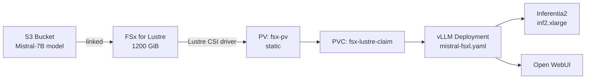
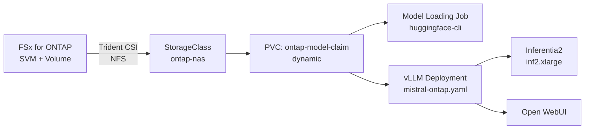
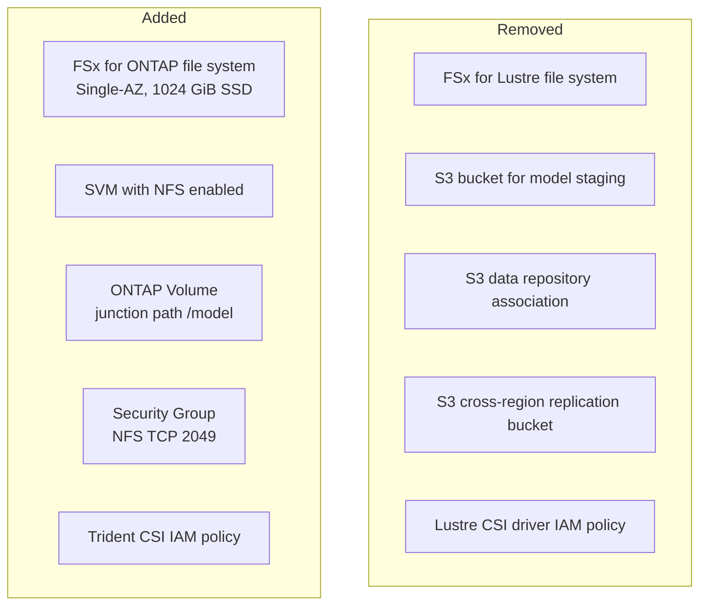

# Design Document: FSx for ONTAP Migration

## Overview

This design describes the migration of the GenAI FSx Workshop on EKS from Amazon FSx for Lustre to Amazon FSx for NetApp ONTAP. The workshop teaches participants to deploy a Generative AI chatbot (Mistral-7B on vLLM with Inferentia accelerators) on Amazon EKS, using a high-performance file system as the persistent storage layer for model data.

The core architectural change is replacing the FSx for Lustre storage stack (Lustre CSI driver, static PV/PVC, S3-linked transparent import) with an FSx for ONTAP storage stack (Trident CSI driver, dynamic provisioning via TridentBackendConfig/StorageClass/PVC, and an explicit model-loading Kubernetes Job). Module 3 (Observability) remains unchanged. Module 4 shifts from S3 data export/replication exercises to ONTAP-native data management features (volume snapshots).

### Key Design Decisions

1. **Trident CSI via Helm (not EKS add-on)**: Helm installation gives participants hands-on experience and avoids AWS Marketplace subscription prerequisites. The Helm chart is pinned to version `100.2502.1` (Trident 25.02), compatible with Kubernetes 1.33.
2. **Dynamic provisioning over static**: Trident's `TridentBackendConfig` + `StorageClass` + `PVC` pattern replaces the manual PV creation workflow. This is simpler, more idiomatic for ONTAP, and teaches a more modern Kubernetes storage pattern.
3. **Kubernetes Job for model loading**: Since ONTAP lacks Lustre's transparent S3 import, a Kubernetes Job using the `huggingface-cli` image downloads Mistral-7B-Instruct-v0.3 directly to the ONTAP-backed PVC. This runs as a workshop step in Module 2 before the vLLM deployment.
4. **NFS protocol**: ONTAP volumes are accessed via NFS (TCP 2049), which is the simplest and most common protocol for shared read-write access in Kubernetes. No iSCSI configuration needed.
5. **Model version upgrade to v0.3**: The migration updates from Mistral-7B-Instruct-v0.2 to v0.3, using the newer vLLM Neuron image (`public.ecr.aws/neuron/pytorch-inference-vllm-neuronx:0.9.1-neuronx-py310-sdk2.25.0-ubuntu22.04`).

## Architecture

### Current Architecture (FSx for Lustre)



- FSx for Lustre CSI driver installed via Helm in `kube-system`
- Static PV referencing Lustre volume handle, DNS name, mount name
- PVC bound to static PV
- Model data transparently imported from S3 on first access
- Sysprep Job pre-warms Lustre cache using `lfs hsm_restore`

### Target Architecture (FSx for ONTAP)



- Trident CSI driver installed via Helm in `trident` namespace
- `TridentBackendConfig` connects Trident to the pre-provisioned FSx ONTAP file system and SVM
- `StorageClass` with `csi.trident.netapp.io` provisioner enables dynamic volume provisioning
- PVC triggers automatic ONTAP volume creation
- Model Loading Job downloads Mistral-7B-Instruct-v0.3 from HuggingFace to the PVC
- vLLM Deployment mounts the same PVC at `/work-dir`

### Infrastructure Changes



## Components and Interfaces

### 1. Trident CSI Driver Deployment

**Namespace**: `trident`
**Installation method**: Helm chart from `netapp-trident/trident-operator`
**Chart version**: `100.2502.1` (Trident 25.02.x)

Helm install command:
```bash
helm repo add netapp-trident https://netapp.github.io/trident-helm-chart
helm repo update

helm install trident-operator netapp-trident/trident-operator \
    --version 100.2502.1 \
    --set cloudProvider="AWS" \
    --set cloudIdentity="'eks.amazonaws.com/role-arn: arn:aws:iam::<ACCOUNT_ID>:role/<TRIDENT_ROLE>'" \
    --namespace trident \
    --create-namespace
```

**IAM policy** for the Trident service account (replaces the Lustre CSI policy):
```json
{
    "Version": "2012-10-17",
    "Statement": [
        {
            "Effect": "Allow",
            "Action": [
                "fsx:DescribeFileSystems",
                "fsx:DescribeVolumes",
                "fsx:DescribeStorageVirtualMachines",
                "fsx:CreateVolume",
                "fsx:DeleteVolume",
                "fsx:UpdateVolume",
                "fsx:TagResource",
                "fsx:UntagResource"
            ],
            "Resource": "*"
        },
        {
            "Action": "iam:CreateServiceLinkedRole",
            "Effect": "Allow",
            "Resource": "*",
            "Condition": {
                "StringLike": {
                    "iam:AWSServiceName": ["fsx.amazonaws.com"]
                }
            }
        },
        {
            "Effect": "Allow",
            "Action": [
                "secretsmanager:GetSecretValue"
            ],
            "Resource": "arn:aws:secretsmanager:*:*:secret:trident-fsx-*"
        }
    ]
}
```

### 2. Kubernetes Storage Resources

#### TridentBackendConfig (`trident-backend-config.yaml`)

```yaml
apiVersion: trident.netapp.io/v1
kind: TridentBackendConfig
metadata:
  name: backend-ontap-nas
  namespace: trident
spec:
  version: 1
  storageDriverName: ontap-nas
  backendName: fsx-ontap
  managementLIF: SVM_MGMT_LIF
  svm: SVM_NAME
  credentials:
    name: fsx-ontap-secret
    namespace: trident
```

The `SVM_MGMT_LIF` and `SVM_NAME` are populated via `sed` from Terraform outputs or AWS CLI queries, following the same pattern as the current Lustre PV template.

A Kubernetes Secret stores the SVM `vsadmin` credentials:
```yaml
apiVersion: v1
kind: Secret
metadata:
  name: fsx-ontap-secret
  namespace: trident
type: Opaque
stringData:
  username: vsadmin
  password: SVM_PASSWORD
```

#### StorageClass (`ontap-storage-class.yaml`)

```yaml
apiVersion: storage.k8s.io/v1
kind: StorageClass
metadata:
  name: ontap-nas-sc
provisioner: csi.trident.netapp.io
parameters:
  backendType: "ontap-nas"
  provisioningType: "thin"
  snapshots: "true"
allowVolumeExpansion: true
mountOptions:
  - nfsvers=4.1
```

#### PersistentVolumeClaim (`ontap-pvc.yaml`)

```yaml
apiVersion: v1
kind: PersistentVolumeClaim
metadata:
  name: ontap-model-claim
spec:
  accessModes:
    - ReadWriteMany
  storageClassName: ontap-nas-sc
  resources:
    requests:
      storage: 100Gi
```

100 GiB is sufficient for the Mistral-7B model (~29 GiB compiled) with room for cache artifacts.

### 3. Model Loading Job (`model-loading-job.yaml`)

```yaml
apiVersion: batch/v1
kind: Job
metadata:
  name: model-download
spec:
  backoffLimit: 3
  template:
    metadata:
      labels:
        app: model-download
    spec:
      restartPolicy: OnFailure
      containers:
      - name: download
        image: public.ecr.aws/parikshit/huggingface-cli:slim
        command:
        - hf
        - download
        - "mistralai/Mistral-7B-Instruct-v0.3"
        - "--local-dir"
        - "/work-dir/Mistral-7B-Instruct-v0.3"
        volumeMounts:
        - name: persistent-storage
          mountPath: "/work-dir"
      volumes:
      - name: persistent-storage
        persistentVolumeClaim:
          claimName: ontap-model-claim
```

The Job uses `restartPolicy: OnFailure` so Kubernetes retries on network errors. `backoffLimit: 3` caps total retries.

### 4. Updated vLLM Deployment (`mistral-ontap.yaml`)

Key changes from `mistral-fsxl.yaml`:
- PVC reference: `ontap-model-claim` instead of `fsx-lustre-claim`
- Model path: `/work-dir/Mistral-7B-Instruct-v0.3/` instead of v0.2
- Container image: updated to `public.ecr.aws/neuron/pytorch-inference-vllm-neuronx:0.9.1-neuronx-py310-sdk2.25.0-ubuntu22.04`
- AZ affinity: uses `FSX_ONTAP_AZ` placeholder instead of `FSX_LUSTRE_AZ`
- Added `/dev/shm` emptyDir volume for compilation
- Updated served-model-name to `mistralai/Mistral-7B-Instruct-v0.3`
- vLLM args updated for v0.3 compatibility (neuronx-distributed-inference framework)

All existing configurations are retained: Neuron scheduler, Inferentia tolerations, health probes, resource requests, Service, and Prometheus annotations.

### 5. Infrastructure Provisioning

#### Terraform Changes

**Removed resources:**
- `aws_fsx_lustre_file_system`
- `aws_fsx_data_repository_association`
- `aws_s3_bucket` (model staging bucket)
- `aws_s3_bucket` (2nd region replication target)
- S3 replication IAM role and policy

**Added resources:**
- `aws_fsx_ontap_file_system` — Single-AZ deployment, 1024 GiB SSD storage capacity, 256 MBps throughput
- `aws_fsx_ontap_storage_virtual_machine` — SVM with NFS enabled
- `aws_fsx_ontap_volume` — Junction path `/model`, 100 GiB size, tiering policy `AUTO`
- Security group rule allowing TCP 2049 (NFS) from EKS worker node security group
- AWS Secrets Manager secret for SVM vsadmin credentials

**Terraform outputs** (consumed by install script and workshop instructions):
- `fsx_ontap_id` — File system ID
- `svm_management_lif` — SVM management LIF DNS name
- `svm_name` — SVM name
- `svm_nfs_lif` — NFS data LIF IP
- `ontap_volume_junction_path` — Volume junction path
- `fsx_ontap_az` — Availability zone of the ONTAP file system

#### CloudFormation Changes

The `GenAIFSXWorkshopOnEKS.yaml` template is updated to:
- Remove FSx for Lustre file system creation and S3 bucket linking
- Add FSx for ONTAP file system, SVM, and volume resources
- Update security group rules for NFS instead of Lustre (TCP 988, 1021-1023)
- Update IAM policies for ONTAP API permissions
- Output SVM management LIF and volume details

### 6. Workshop Content Structure

| Module | Current | Target |
|--------|---------|--------|
| Introduction | FSx for Lustre + S3 description | FSx for ONTAP + Trident description |
| Module 1 | Lustre CSI driver + static PV/PVC | Trident CSI driver + TridentBackendConfig + StorageClass + dynamic PVC |
| Module 2 | Deploy vLLM with `mistral-fsxl.yaml` | Model Loading Job + deploy vLLM with `mistral-ontap.yaml` |
| Module 3 | Observability (unchanged) | Observability (unchanged) |
| Module 4 | S3 export + cross-region replication | ONTAP volume snapshots + model data inspection |

### 7. Install/Cleanup Script Changes

#### `install.sh` Changes
- Replace Lustre CSI IAM policy with Trident IAM policy
- Replace `helm install aws-fsx-csi-driver` with `helm install trident-operator`
- Replace FSx Lustre discovery (`aws fsx describe-file-systems` with `LustreConfiguration` queries) with ONTAP discovery (`aws fsx describe-storage-virtual-machines`, `aws fsx describe-volumes`)
- Replace `sed` commands for Lustre PV template with `sed` commands for TridentBackendConfig template
- Apply TridentBackendConfig, StorageClass, PVC, and Model Loading Job
- Wait for Model Loading Job completion before deploying vLLM
- Update `mistral-fsxl.yaml` references to `mistral-ontap.yaml`

#### `cleanup.sh` Changes
- Replace `helm uninstall aws-fsx-csi-driver` with `helm uninstall trident-operator -n trident`
- Replace `kubectl delete -f mistral-fsxl.yaml` with `kubectl delete -f mistral-ontap.yaml`
- Replace Lustre PV/PVC cleanup (`fsx-lustre-claim`, `fsx-pv`) with ONTAP PVC cleanup (`ontap-model-claim`)
- Delete TridentBackendConfig, StorageClass, and Secret
- Remove sysprep and check resources (no longer needed)

## Data Models

### Kubernetes Resources (New)

| Resource | Name | Namespace | Purpose |
|----------|------|-----------|---------|
| Secret | `fsx-ontap-secret` | `trident` | SVM vsadmin credentials for Trident backend |
| TridentBackendConfig | `backend-ontap-nas` | `trident` | Connects Trident to FSx ONTAP SVM |
| StorageClass | `ontap-nas-sc` | cluster-scoped | Defines ONTAP NAS provisioning parameters |
| PVC | `ontap-model-claim` | `default` | Claims 100 GiB ONTAP volume for model storage |
| Job | `model-download` | `default` | Downloads Mistral-7B-Instruct-v0.3 to PVC |
| Deployment | `vllm-mistral-inf2-deployment` | `default` | vLLM inference server (updated manifest) |

### Kubernetes Resources (Removed)

| Resource | Name | Purpose |
|----------|------|---------|
| PV | `fsx-pv` | Static PV for Lustre volume |
| PVC | `fsx-lustre-claim` | Claim for Lustre PV |
| PV | `fsx-pv-check` | Check PV for Lustre |
| PVC | `fsx-lustre-claim-check` | Check PVC for Lustre |
| PV | `fsx-pv-sysprep` | Sysprep PV for Lustre |
| PVC | `fsx-lustre-claim-sysprep` | Sysprep PVC for Lustre |
| Job | `sysprep` | Lustre HSM restore pre-warming |
| Deployment | `sysprep-check` | Lustre data verification |

### AWS Resources (New)

| Resource | Type | Key Properties |
|----------|------|----------------|
| FSx ONTAP File System | `aws_fsx_ontap_file_system` | Single-AZ, 1024 GiB SSD, 256 MBps throughput |
| SVM | `aws_fsx_ontap_storage_virtual_machine` | NFS enabled, vsadmin credentials |
| ONTAP Volume | `aws_fsx_ontap_volume` | 100 GiB, junction path `/model`, tiering AUTO |
| Security Group Rule | `aws_security_group_rule` | TCP 2049 from EKS worker SG |
| Secrets Manager Secret | `aws_secretsmanager_secret` | SVM vsadmin password |

### AWS Resources (Removed)

| Resource | Type |
|----------|------|
| FSx Lustre File System | `aws_fsx_lustre_file_system` |
| S3 Bucket (model) | `aws_s3_bucket` |
| S3 Bucket (2nd region) | `aws_s3_bucket` |
| Data Repository Association | `aws_fsx_data_repository_association` |
| S3 Replication Config | `aws_s3_bucket_replication_configuration` |

## Error Handling

### Infrastructure Provisioning Errors

| Error Scenario | Handling Strategy |
|----------------|-------------------|
| FSx ONTAP file system not in AVAILABLE state | `install.sh` checks file system status before proceeding; exits with non-zero code and descriptive error message if not available |
| SVM not found or not ready | `install.sh` queries `aws fsx describe-storage-virtual-machines` and validates lifecycle status before populating templates |
| Trident Helm install fails | Script checks `helm install` exit code; prints troubleshooting guidance (check namespace, RBAC, image pull) |
| TridentBackendConfig fails to register | Workshop instructions include `kubectl describe tbc -n trident` verification step; common errors: wrong SVM LIF, bad credentials |

### Model Loading Errors

| Error Scenario | Handling Strategy |
|----------------|-------------------|
| HuggingFace download fails (network) | Job configured with `restartPolicy: OnFailure` and `backoffLimit: 3`; Kubernetes retries automatically |
| Insufficient PVC storage | PVC requests 100 GiB which is ~3x the model size; if exceeded, Job fails with clear disk space error in logs |
| PVC not bound when Job starts | Job pod stays in Pending state; workshop instructions include PVC status verification before running the Job |
| Model download incomplete | Workshop includes verification step: `kubectl exec` into a check pod and `ls -la /work-dir/Mistral-7B-Instruct-v0.3/` to confirm all files present |

### vLLM Deployment Errors

| Error Scenario | Handling Strategy |
|----------------|-------------------|
| Model not found at mount path | vLLM container fails to start; liveness probe detects failure; workshop instructs checking Job completion first |
| NFS mount timeout | Check security group allows TCP 2049; check ONTAP file system and SVM are in same VPC/subnet as EKS nodes |
| Inferentia node not available | Same as current workshop — EKS Auto Mode provisions inf2 node on demand; nodepool creation verified before vLLM deploy |

### Cleanup Errors

| Error Scenario | Handling Strategy |
|----------------|-------------------|
| PVC deletion blocked by running pods | `cleanup.sh` deletes deployments and jobs before PVCs; ordered teardown |
| Trident backend deletion fails | Script deletes PVCs first, then StorageClass, then TridentBackendConfig, then Secret, then Helm uninstall |

## Testing Strategy

### Why Property-Based Testing Does Not Apply

This feature consists entirely of:
- **Infrastructure as Code** (Terraform resources, CloudFormation templates) — declarative configuration, not functions with inputs/outputs
- **Kubernetes YAML manifests** — static resource definitions
- **Shell scripts** (install.sh, cleanup.sh) — imperative provisioning scripts
- **Hugo markdown content** — documentation

None of these involve pure functions, data transformations, parsers, or business logic algorithms where universal properties could be meaningfully tested across generated inputs. Property-based testing is not appropriate for this feature.

### Testing Approach

#### 1. Infrastructure Validation Tests

- **Terraform plan validation**: Run `terraform plan` to verify the new ONTAP resources are created and Lustre resources are removed without errors
- **CloudFormation template validation**: Run `aws cloudformation validate-template` on the updated template
- **Security group rule verification**: Confirm NFS port 2049 is open from EKS worker security group to ONTAP file system

#### 2. Kubernetes Manifest Validation Tests

- **YAML syntax validation**: Validate all new YAML manifests with `kubectl apply --dry-run=client`
- **Resource reference consistency**: Verify PVC names match across TridentBackendConfig, StorageClass, PVC, Job, and Deployment manifests
- **Volume mount path consistency**: Confirm `/work-dir` mount path is consistent across Job and Deployment

#### 3. Script Testing

- **install.sh smoke test**: Run against a provisioned environment and verify:
  - Trident pods are Running in `trident` namespace
  - TridentBackendConfig shows `Success` status
  - StorageClass is created
  - PVC is Bound
  - Model Loading Job completes
  - vLLM pod reaches Running state
- **cleanup.sh smoke test**: Run and verify all resources are removed cleanly
- **Error path testing**: Test `install.sh` behavior when FSx ONTAP is not in AVAILABLE state

#### 4. End-to-End Workshop Walkthrough

- **Full workshop execution**: Walk through all modules start to finish
  - Module 1: Trident CSI driver deploys, backend registers, PVC binds
  - Module 2: Model downloads, vLLM starts, WebUI accessible, chatbot responds
  - Module 3: Observability dashboards work (unchanged)
  - Module 4: ONTAP snapshot creation and inspection works
- **Duration validation**: Confirm workshop completes within ~2 hours
- **Performance validation**: Confirm vLLM loads model and begins serving within 10 minutes of pod scheduling

#### 5. Content Review

- **Link validation**: Verify all internal links between workshop pages work
- **Screenshot accuracy**: Update screenshots that show FSx Lustre console with FSx ONTAP console equivalents
- **Command accuracy**: Verify all copy-paste commands in workshop content execute correctly
- **Terminology consistency**: Confirm no residual FSx for Lustre references remain in updated content

