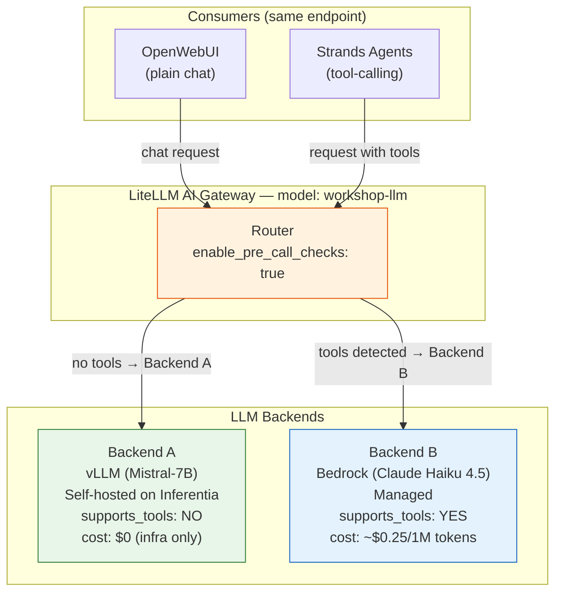

## Overview

In this section you will configure the AWS Inferentia nodepool on the EKS cluster, install the AWS Neuron plugins, and then deploy the vLLM inference engine Pod.

##### Step 1: Install Neuron Device Plugin, Scheduler & Node Problem Detector

In order to use the AWS Inferentia accelerated compute nodes with the Mistral LLM, we need to install the Neuron Device Plugin, Neuron Scheduler, and Neuron Node Problem Detector & Recovery on the EKS Cluster using a helm chart. Click on this link to learn more about the [AWS Neuron Helm Chart](https://aws.amazon.com/blogs/containers/announcing-aws-neuron-helm-chart/).

1. Copy & paste the below command into your terminal to install the neuron helm chart.

:::code{showCopyAction=true showLineNumbers=true language=bash}
cd /home/participant/environment/terraform

helm upgrade --install neuron-helm-chart \
    oci://public.ecr.aws/neuron/neuron-helm-chart \
    --namespace kube-system \
    --version 1.5.0 \
    -f ./helm-values/neuron-values.yaml
:::

You should see an output similar to the one below.

:::code{showCopyAction=false showLineNumbers=false language=bash}
Release "neuron-helm-chart" does not exist. Installing it now.
Pulled: public.ecr.aws/neuron/neuron-helm-chart:1.5.0
Digest: sha256:...
NAME: neuron-helm-chart
LAST DEPLOYED: Thu Jul 24 01:57:53 2025
NAMESPACE: kube-system
STATUS: deployed
REVISION: 1
:::

Lets take a moment to understand each of these components.

###### Neuron Device plugin

The Neuron device plugin exposes Neuron cores & devices to kubernetes as a resource, where `aws.amazon.com/neuroncore` and `aws.amazon.com/neuron` are the resources that the neuron device plugin registers with the kubernetes.

For more information on this, please refer [Neuron Device Plugin](https://awsdocs-neuron.readthedocs-hosted.com/en/latest/containers/kubernetes-getting-started.html#neuron-device-plugin)

###### Neuron Scheduler
The Neuron scheduler extension is required for scheduling pods that require more than one Neuron core or device resource.

For more information on this, please refer [Neuron Scheduler Extension](https://awsdocs-neuron.readthedocs-hosted.com/en/latest/containers/kubernetes-getting-started.html#neuron-scheduler-extension)

###### Neuron Node Problem Detector and Recovery

This component combines a Neuron-specific Node Problem Detector (NPD) with a Node Recovery controller. NPD watches kernel logs on each Neuron node for hardware errors (uncorrectable SRAM, HBM, and NeuronCore errors, as well as DMA errors) and surfaces them as Kubernetes node conditions. Node Recovery (enabled in this workshop via `npd.nodeRecovery.enabled`) reacts to those conditions by cordoning and replacing unhealthy nodes so that workloads reschedule onto healthy Neuron hardware.

CloudWatch metrics for Neuron hardware utilization and errors are published by a separate component, the **Neuron Monitor**, which you will install in Module 3.

For more information on this, please refer to the [Neuron Node Problem Detector and Recovery](https://awsdocs-neuron.readthedocs-hosted.com/en/latest/containers/tutorials/k8s-neuron-problem-detector-and-recovery.html) documentation.

#####  Step 2: Create EKS Auto Mode NodePool and EC2 NodeClass for AWS Inferentia Accelerators

The EKS Auto Mode configuration comes in the form of a NodePool Custom Resource (CR). The NodePool sets constraints on the EC2 nodes that can be used by EKS Auto Mode, the pods that can run on those EC2 nodes, where a NodePool can handle many different pod shapes. EKS Auto Mode makes scheduling and provisioning decisions based on pod attributes such as labels and affinity. An EKS cluster can have more than one NodePool, and in this workshop we will declare an additional inferentia NodePool.

1. Run the following command to create the EKS Auto Mode inferentia NodePool definition

:::code[]{language=bash showLineNumbers=false showCopyAction=true}
NODE_ROLE=$(cd /home/participant/environment/terraform && terraform output --raw eks_node_iam_role_name)
cd /home/participant/environment/eks/genai
export NODE_ROLE
:::

2. Lets take a look at the EKS Auto NodePool definition for the inferentia NodePool before we apply it. This configuration will create a new nodepool for AWS Inferentia (using "INF2" type for instance-family), where the AWS INF2 compute nodes will power Generative AI application (vLLM pod).

::code[cat inferentia_nodepool.yaml]{language=bash showLineNumbers=false showCopyAction=true}

:::alert{header="What to observe in the NodePool definition" type="info"}
When reviewing the output, pay attention to these key fields:
- **instance-family: ["inf2"]** — constrains EKS Auto Mode to only provision AWS Inferentia2 instances for this NodePool
- **instance-size: ["xlarge"]** — pins to `inf2.xlarge` (1 Inferentia2 chip with 2 NeuronCores)
- **nodeSelector / tolerations** — pods must explicitly request this NodePool via matching labels and tolerations
- **disruption policy** — controls how EKS Auto Mode handles node consolidation and expiry

These constraints ensure that only pods requesting Neuron resources get scheduled onto the expensive accelerated compute nodes.
:::

4. Let's deploy the inferentia NodePool, substituting the `$NODE_ROLE` placeholder with the IAM role name retrieved above.

::code[envsubst '$NODE_ROLE' < inferentia_nodepool.yaml | kubectl apply -f -]{language=bash showLineNumbers=false showCopyAction=true}

5. Verify NodePool and NodeClass:
::code[kubectl get nodepool,nodeclass inferentia]{language=bash showLineNumbers=false showCopyAction=true}

You should see an output similar to the one below. **Note** that you will initially see 0 nodes in the pool, that's because we haven't deployed any pods that need this accelerated compute node.

:::code{showCopyAction=false showLineNumbers=false language=bash}
NAME                               NODECLASS    NODES   READY   AGE
nodepool.karpenter.sh/inferentia   inferentia   0       True    11s

NAME                                     ROLE                                              READY   AGE
nodeclass.eks.amazonaws.com/inferentia   eksworkshop-eks-auto-20250103063226329700000003   True    11s
:::

##### Step 3: Load the Mistral-7B Model onto the FSx for ONTAP Volume

:::alert{header="Important — Why is this step needed?" type="info"}
FSx for NetApp ONTAP is a fully-featured enterprise file system that supports NFS, SMB, and iSCSI, with features like snapshots, clones, SnapMirror replication, data compression, and deduplication. In this workshop we use it as a high-performance shared volume for model data — the same volume can be mounted `ReadWriteMany` across pods, enabling both the model loading Job and the vLLM inference pod to share a single copy of the model.

Because the model data lives on a persistent volume (rather than being baked into the container image or streamed on demand), we stage it onto the ONTAP-backed PVC once using a Kubernetes Job that downloads a **pre-compiled** Mistral-7B-Instruct-v0.3 model (with Neuron compiled artifacts) from HuggingFace directly onto the PVC. Using pre-compiled artifacts means vLLM can skip the Neuron compilation step and start serving immediately.

This is a **one-time operation**. Once the model data is on the FSx for ONTAP volume, it persists across pod restarts and redeployments. If the vLLM pod is deleted and recreated, it will load the model directly from the volume without needing to download it again. This is one of the key benefits of using persistent storage like FSx for ONTAP for inference workloads — the model is loaded once and reused by any pod that mounts the same volume.
:::

1. Apply the Model Loading Job manifest. This Job will download the pre-compiled Mistral-7B-Instruct-v0.3 model (including Neuron compiled artifacts) from HuggingFace and store it on the `ontap-model-claim` PVC that you created in Module 1.

:::code[]{language=bash showLineNumbers=false showCopyAction=true}
cd /home/participant/environment/eks/FSxONTAP
kubectl apply -f model-loading-job.yaml
:::

2. The model download will take several minutes depending on network speed. Wait for the Job to complete by running the following command. This will block until the Job finishes successfully (or time out after 30 minutes).

:::alert{header="Expected time" type="info"}
The pre-compiled Mistral-7B model is approximately 29 GB. The download typically completes in **4–6 minutes**.
:::

:::code[]{language=bash showLineNumbers=false showCopyAction=true}
kubectl wait --for=condition=complete job/model-download --timeout=1800s
:::

You should see an output similar to:

:::code{showCopyAction=false showLineNumbers=false language=bash}
job.batch/model-download condition met
:::

:::alert{header="Tip — Watch download progress" type="info"}
The `kubectl wait` command above blocks silently until the Job completes. If you'd prefer to watch live progress (HuggingFace download percentages, file transfer status, etc.), open a **second terminal** and tail the Job's pod logs:

:::code[]{language=bash showLineNumbers=false showCopyAction=true}
kubectl logs -f job/model-download
:::

The log stream will end when the download finishes, at which point the `kubectl wait` command in your first terminal will also return.
:::

:::alert{header="Note" type="info"}
If the Job fails, Kubernetes will automatically retry it (up to 3 times) thanks to the `restartPolicy: OnFailure` and `backoffLimit: 3` configuration. You can check the Job status and pod logs with:
`kubectl get job model-download` and `kubectl logs job/model-download`
:::

3. Verify that the model data has been successfully downloaded to the persistent volume. Run a quick check to confirm the model files are present:

:::code[]{language=bash showLineNumbers=false showCopyAction=true}
kubectl run model-check --rm -it --restart=Never \
  --image=public.ecr.aws/amazonlinux/amazonlinux:2023 \
  --overrides='{"spec":{"containers":[{"name":"model-check","image":"public.ecr.aws/amazonlinux/amazonlinux:2023","command":["ls","-la","/work-dir/Mistral-7B-Instruct-v0.3/"],"volumeMounts":[{"name":"persistent-storage","mountPath":"/work-dir"}]}],"volumes":[{"name":"persistent-storage","persistentVolumeClaim":{"claimName":"ontap-model-claim"}}]}}' \
  -- ls -la /work-dir/Mistral-7B-Instruct-v0.3/
:::

You should see the model weight files (e.g., `model-00001-of-00003.safetensors`), tokenizer files, and configuration files listed in the output. This confirms the model is ready for the vLLM inference pod.

##### Step 4: Deploy the vLLM application Pod

You will now deploy the vLLM pod, which will provide model serving capability through its inference endpoint. Once the vLLM Pod is online, it will load the pre-compiled Mistral-7B model from the FSx for NetApp ONTAP volume. Because the model includes pre-compiled Neuron artifacts, vLLM skips the compilation step and starts serving in approximately 3 - 5 minutes (compared to 15+ minutes without pre-compiled artifacts).

1. Run the below commands to update the mistral-ontap.yaml with your AWS environment variables.

:::code[]{language=bash showLineNumbers=false showCopyAction=true}
cd /home/participant/environment/eks/genai
:::

:::code[]{language=bash showLineNumbers=false showCopyAction=true}
FSX_ONTAP_AZ=$(aws fsx describe-file-systems --region $AWS_REGION --query "FileSystems[?FileSystemType=='ONTAP'].OntapConfiguration.PreferredSubnetId" --output text | head -1 | xargs -I {} aws ec2 describe-subnets --subnet-ids {} --query 'Subnets[0].AvailabilityZone' --output text)
export FSX_ONTAP_AZ
:::

:::alert{header="Why pin to the FSx ONTAP preferred AZ?" type="info"}
Although your FSx for ONTAP file system is deployed in **Multi-AZ** mode (accessible from both AZs), we pin the vLLM pod to the **preferred AZ** (where the active file server runs) to minimize cross-AZ NFS latency and avoid cross-AZ data transfer costs. The model data is accessible from either AZ, but placing compute in the same AZ as the active storage provides optimal performance. If a failover occurs, the pod continues to work — it just routes NFS traffic cross-AZ until the file system fails back.
:::

2. Run the below command to deploy the vLLM Pod, substituting the `$FSX_ONTAP_AZ` placeholder with the availability zone retrieved above.

::code[envsubst '$FSX_ONTAP_AZ' < mistral-ontap.yaml | kubectl apply -f -]{language=bash showLineNumbers=false showCopyAction=true}

3. Now run the below command, and you will see the Inferentia node count increase to 1, as we have deployed a pod that requires the accelerated compute node. Note that the increase to a value of 1 can take 30 seconds to update.
::code[kubectl get nodepool,nodeclass inferentia]{language=bash showLineNumbers=false showCopyAction=true}

:::alert{header="Note" type="info"}
**The vLLM pod deployment will take approx. 7 minutes. You can continue to the next steps, and don't need to wait for this step to complete**.  
:::

4. Run the below command to inspect the vLLM's mistral-ontap.yaml deployment file.

::code[cat mistral-ontap.yaml]{language=bash showLineNumbers=false showCopyAction=true}

:::alert{header="Note" type="info"}
You will notice a single pod deployment request, with a request for 2 AWS Inferentia NeuronCores, persistent storage using the PVC you created previously (`ontap-model-claim`), and also some model parameters. The model (including pre-compiled Neuron artifacts) was loaded onto this PVC by the Model Loading Job in Step 3. The `NEURON_COMPILED_ARTIFACTS` environment variable tells vLLM where to find the pre-compiled model, allowing it to skip the compilation step.
:::

:::code[]{language=yaml showLineNumbers=true showCopyAction=false}
# mistral-ontap.yaml
apiVersion: apps/v1
kind: Deployment
metadata:
  name: vllm-mistral-inf2-deployment
spec:
  replicas: 1
  selector:
    matchLabels:
      app: vllm-mistral-inf2-server
  template:
    metadata:
      labels:
        app: vllm-mistral-inf2-server
    spec:
      automountServiceAccountToken: false
      affinity:
        nodeAffinity:
          requiredDuringSchedulingIgnoredDuringExecution:
            nodeSelectorTerms:
            - matchExpressions:
              - key: topology.kubernetes.io/zone
                operator: In
                values:
                - FSX_ONTAP_AZ                                  # <<<<< Replace with your FSx ONTAP AZ
      nodeSelector:
        node.kubernetes.io/instance-type: inf2.xlarge           # <<<<< Pin to inf2.xlarge
      tolerations:
      - key: "aws.amazon.com/neuron"
        operator: "Exists"
        effect: "NoSchedule"
      containers:
      - name: inference-server
        image: public.ecr.aws/neuron/pytorch-inference-vllm-neuronx:0.9.1-neuronx-py311-sdk2.26.1-ubuntu22.04
        command: ["vllm", "serve"]
        args:
        - /work-dir/Mistral-7B-Instruct-v0.3                  # <<<<< Local model path on ONTAP volume
        - --served-model-name=mistral-7b-neuron
        - --trust-remote-code
        - --tensor-parallel-size=2
        - --max-model-len=4096
        - --max-num-seqs=4
        - --device=neuron
        resources:                                             # <<<<< Neuron Resources
          requests:
            cpu: "2"
            memory: 8Gi
            aws.amazon.com/neuroncore: 2                       # <<<<< Neuron Resources Request
          limits:
            aws.amazon.com/neuroncore: 2                       # <<<<< Neuron Resources Limits
        env:
        - name: NEURON_COMPILED_ARTIFACTS
          value: /work-dir/Mistral-7B-Instruct-v0.3           # <<<<< Pre-compiled artifacts path
        volumeMounts:
        - name: persistent-storage
          mountPath: "/work-dir"                               # <<<<< FSx for ONTAP PVC mount
(...)
      volumes:
      - name: persistent-storage
        persistentVolumeClaim:
          claimName: ontap-model-claim                         # <<<<< FSx for ONTAP PVC
:::

5. You can monitor the vLLM pod creation by running the following command periodically, until you see it transitioning to `Running`, and when its at the 7 minute mark (and the vLLM is online and the model has been loaded into memory)

::code[kubectl get pod]{language=bash showLineNumbers=false showCopyAction=true}

:::alert{header="Note" type="info"}
The screenshot above shows the expected pod status progression. Your output may look slightly different depending on timing — the key is to see the vLLM pod transition from `Pending` → `ContainerCreating` → `Running`.
:::

6. While you are waiting for the vLLM pod to deploy, lets go check out the EKS NodePools by navigating to the [Amazon EKS cluster Console](https://console.aws.amazon.com/eks)

7. Click on your cluster name (i.e. eksworkshop)

8. Click on the   **Compute** tab, you will see there is now a new AWS Inferentia **inf2.xlarge** compute node

:::alert{header="What to look for" type="info"}
In the EKS console Compute tab, you should see the `inf2.xlarge` node listed under the **inferentia** NodePool. The node status should show **Ready**. This confirms that EKS Auto Mode provisioned the Inferentia accelerated compute node in response to the vLLM pod's resource request for `aws.amazon.com/neuroncore: 2`.
:::

9. Click on the **Node name**, where it will show you the capacity allocation and Pod details relating to the inf2.xlarge compute node

##### Step 5: Deploy the LiteLLM AI Gateway

In production environments, it is best practice to front your LLM backends with an **AI Gateway** — a proxy layer that provides unified routing, observability, cost management, and intelligent model selection. In this workshop, we deploy [LiteLLM](https://github.com/BerriAI/litellm) as our AI Gateway.

The gateway exposes a single OpenAI-compatible endpoint (`workshop-llm`) and intelligently routes requests:
- **Plain chat** (no tools) → self-hosted Mistral-7B on Inferentia (fast, zero API cost)
- **Tool-calling** (agentic workloads) → Amazon Bedrock Claude Haiku 4.5 (reliable structured output)

This routing happens **automatically** — the gateway inspects the incoming request and decides where to send it. Applications don't need to be aware of which backend serves them.

:::alert{header="Why an AI Gateway?" type="info"}
In enterprise environments, you may self-host smaller models for cost-effective basic inference, while routing complex reasoning or tool-use to larger managed models. The AI Gateway pattern gives you:
- **Single endpoint** for all consumers (WebUI, agents, APIs)
- **Intelligent routing** based on request capabilities (tool-calling, context length, etc.)
- **Fallback and retry** across multiple backends
- **Cost tracking** and per-model usage visibility

With larger self-hosted models (70B+), you could route everything locally. The gateway remains valuable for failover, cost optimization, and multi-model orchestration.
:::

1. Review the LiteLLM configuration:

:::code[]{language=bash showLineNumbers=false showCopyAction=true}
cat /home/participant/environment/eks/genai/litellm-config.yaml
:::

:::code[]{language=yaml showLineNumbers=true showCopyAction=false}
# litellm-config.yaml — AI Gateway routing configuration
model_list:
  - model_name: "workshop-llm"
    litellm_params:
      model: "openai/mistral-7b-neuron"
      api_base: "http://vllm-mistral7b-service.default.svc.cluster.local/v1"
      api_key: "not-needed"
    model_info:
      supports_function_calling: false      # ← Mistral-7B: chat only

  - model_name: "workshop-llm"
    litellm_params:
      model: "bedrock/us.anthropic.claude-haiku-4-5-20251001-v1:0"
    model_info:
      supports_function_calling: true       # ← Haiku 4.5: tool-calling capable

router_settings:
  enable_pre_call_checks: true              # ← Inspect request → route to capable backend
:::

:::alert{header="How routing works" type="info"}
When `enable_pre_call_checks` is enabled, LiteLLM inspects each incoming request:
- If the request contains `tools` (function schemas) → only backends with `supports_function_calling: true` are eligible
- If the request is plain chat → any backend can serve it (prefers the first one listed)

This means OpenWebUI chat goes to your self-hosted Mistral-7B, while AI agents with tools automatically route to Bedrock — all through the same endpoint.
:::

2. Deploy the LiteLLM ConfigMap:

:::code[]{language=bash showLineNumbers=false showCopyAction=true}
kubectl apply -f /home/participant/environment/eks/genai/litellm-config.yaml
:::

3. Deploy the LiteLLM Gateway (ServiceAccount, Deployment, and Service):

:::code[]{language=bash showLineNumbers=true showCopyAction=true}
cd /home/participant/environment/eks/genai
export AWS_REGION
envsubst '$AWS_REGION' < litellm-deployment.yaml | kubectl apply -f -
:::

:::alert{header="Pod Identity for Bedrock Access" type="info"}
The Terraform that provisioned your cluster also created an **EKS Pod Identity Association** linking the `litellm` ServiceAccount to an IAM role with `bedrock:InvokeModel` permissions. When the LiteLLM pod starts, EKS automatically injects temporary AWS credentials — no access keys or IRSA annotations needed.
:::

4. Wait for the LiteLLM gateway to be ready:

:::code[]{language=bash showLineNumbers=true showCopyAction=true}
kubectl rollout status deployment/litellm-gateway --timeout=120s
:::

5. Verify the gateway is healthy and can reach both backends:

:::code[]{language=bash showLineNumbers=true showCopyAction=true}
kubectl get pods -l app=litellm-gateway
kubectl get svc litellm-service
:::

:::code{showCopyAction=false showLineNumbers=false language=bash}
NAME                                READY   STATUS    RESTARTS   AGE
litellm-gateway-7d4f8b9c7-x2k4m   1/1     Running   0          45s

NAME              TYPE        CLUSTER-IP      EXTERNAL-IP   PORT(S)    AGE
litellm-service   ClusterIP   172.20.45.123   <none>        4000/TCP   45s
:::

### Summary
You have now deployed the vLLM inference engine and the LiteLLM AI Gateway. The gateway provides a single endpoint that routes chat to your self-hosted model and tool-calling to Bedrock. Continue to the next lab section to deploy the WebUI Pod, which will connect through the AI Gateway to interact with the Mistral-7B model.
