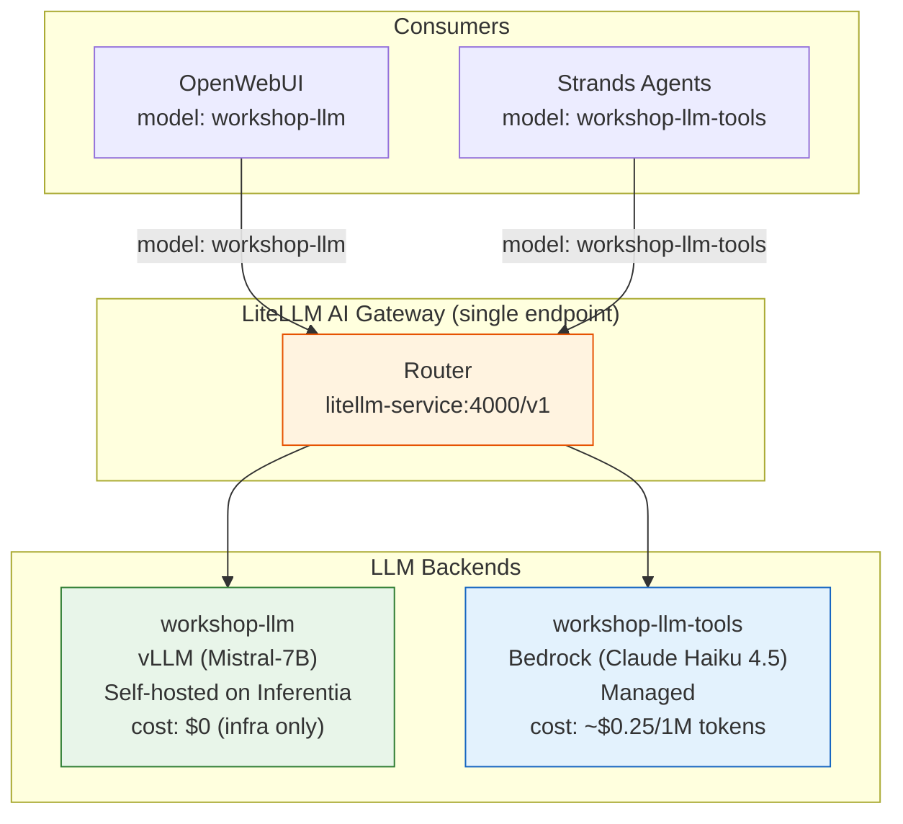

## Overview

In production environments, it is best practice to front your LLM backends with an **AI Gateway** — a proxy layer that provides unified routing, observability, cost management, and intelligent model selection. In this workshop, we deploy [LiteLLM](https://github.com/BerriAI/litellm) as our AI Gateway.

The gateway exposes two named model endpoints through a single service:
- **`workshop-llm`** → self-hosted Mistral-7B on Inferentia (chat, zero API cost)
- **`workshop-llm-tools`** → Amazon Bedrock Claude Haiku 4.5 (tool-calling, reliable structured output)

Consumers select the appropriate model for their workload. OpenWebUI requests `workshop-llm` for everyday chat; AI agents request `workshop-llm-tools` for reliable tool execution.

:::alert{header="Why an AI Gateway?" type="info"}
In enterprise environments, you typically self-host smaller models for cost-effective basic inference and route complex agentic workloads to larger, more capable models. The AI Gateway pattern gives you:
- **Single service endpoint** for all consumers — one DNS name, multiple model backends
- **Model-per-workload routing** — consumers pick the right model for the job
- **Fallback and retry** across multiple backends
- **Cost tracking** and per-model usage visibility

With larger self-hosted models (70B+), you could route everything locally. The gateway remains valuable for failover, cost optimization, and multi-model orchestration.
:::

---

##### Step 1: Review the LiteLLM configuration

::::expand{header="Click to review litellm-config.yaml"}

:::code[]{language=bash showLineNumbers=false showCopyAction=true}
cat /home/participant/environment/eks/genai/litellm-config.yaml
:::

:::code[]{language=yaml showLineNumbers=true showCopyAction=false}
# litellm-config.yaml — AI Gateway routing configuration
model_list:
  - model_name: "workshop-llm"                                          # ← OpenWebUI uses this
    litellm_params:
      model: "openai/mistral-7b-neuron"
      api_base: "http://vllm-mistral7b-service.default.svc.cluster.local/v1"
      api_key: "not-needed"

  - model_name: "workshop-llm-tools"                                    # ← Agents use this
    litellm_params:
      model: "bedrock/us.anthropic.claude-haiku-4-5-20251001-v1:0"
:::

::::

:::alert{header="How routing works" type="info"}
Each model name maps to a specific backend:
- Requests for `workshop-llm` → routed to the self-hosted vLLM (Mistral-7B on Inferentia)
- Requests for `workshop-llm-tools` → routed to Amazon Bedrock (Claude Haiku 4.5)

OpenWebUI is configured to request `workshop-llm`, so chat stays on your self-hosted model at zero API cost. AI agents request `workshop-llm-tools` because tool-calling requires a model with strong structured-output capability. Both go through the same gateway endpoint (`litellm-service:4000`).
:::

##### Step 2: Deploy the LiteLLM ConfigMap

:::code[]{language=bash showLineNumbers=false showCopyAction=true}
kubectl apply -f /home/participant/environment/eks/genai/litellm-config.yaml
:::

##### Step 3: Deploy the LiteLLM Gateway

:::code[]{language=bash showLineNumbers=true showCopyAction=true}
cd /home/participant/environment/eks/genai
export AWS_REGION
envsubst '$AWS_REGION' < litellm-deployment.yaml | kubectl apply -f -
:::

:::alert{header="Pod Identity for Bedrock Access" type="info"}
The Terraform that provisioned your cluster also created an **EKS Pod Identity Association** linking the `litellm` ServiceAccount to an IAM role with `bedrock:InvokeModel` permissions. When the LiteLLM pod starts, EKS automatically injects temporary AWS credentials — no access keys or IRSA annotations needed.
:::

##### Step 4: Verify the gateway is ready

:::code[]{language=bash showLineNumbers=true showCopyAction=true}
kubectl rollout status deployment/litellm-gateway --timeout=120s
:::

:::code[]{language=bash showLineNumbers=true showCopyAction=true}
kubectl get pods -l app=litellm-gateway
kubectl get svc litellm-service
:::

:::code{showCopyAction=false showLineNumbers=false language=bash}
NAME                                READY   STATUS    RESTARTS   AGE
litellm-gateway-7d4f8b9c7-x2k4m   1/1     Running   0          45s

NAME              TYPE        CLUSTER-IP      EXTERNAL-IP   PORT(S)    AGE
litellm-service   ClusterIP   172.20.45.123   <none>        4000/TCP   45s
:::

---

### Summary

You have deployed the LiteLLM AI Gateway. It provides a single service endpoint (`litellm-service:4000`) that routes requests to the appropriate LLM backend based on model name. Continue to the next section to deploy the OpenWebUI chat interface, which connects through this gateway.
