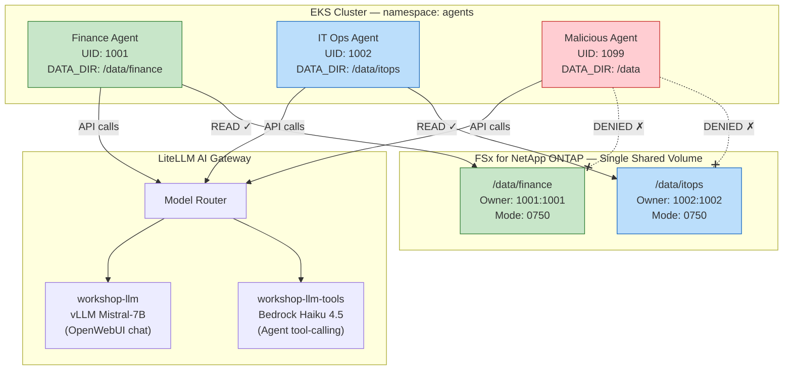

## Module Overview

In enterprise environments, **multiple AI agents** may operate against a shared storage layer — each requiring access to **only its designated data domain**. This module demonstrates how Amazon FSx for NetApp ONTAP's **native POSIX permissions** (UID/GID ownership + file mode) enforce strict data boundaries for AI agents — even when all agents share the same volume, same namespace, and same LLM backend.

You will deploy **three AI agents** using [AWS Strands Agents SDK](https://github.com/strands-agents/sdk-python) (open source), each with a distinct role:

| Agent | Role | UID | Can Access |
|-------|------|-----|-----------|
| **Finance Agent** | Financial analyst | 1001 | `/data/finance` only |
| **IT Operations Agent** | IT Ops assistant | 1002 | `/data/itops` only |
| **Malicious Agent** | Simulated attacker | 1099 | **Neither** — permission denied |

:::alert{header="Why This Matters" type="info"}
As organizations deploy autonomous AI agents that can read, analyze, and act on data, **storage-level access control** becomes critical. Unlike application-layer auth that agents could potentially bypass, FSxN enforces permissions at the **NFS protocol level** — the agent literally cannot read bytes it's not authorized to access, regardless of what the LLM instructs it to do.
:::

---

## Architecture

**Key Design Point**: All agents mount the **same PVC** (`agent-shared-data`). There is no volume-level isolation, no namespace separation, and no Kubernetes RBAC involved. The **only** access control mechanism is POSIX UID/GID permissions set on the FSxN volume subdirectories.

---

::::expand{header="Click here to learn about AWS Strands Agents SDK"}

#### AWS Strands Agents SDK

**Strands Agents** is an open-source Python SDK by AWS for building AI agents with tool-use capabilities. Key features:

- **Model-agnostic** — works with any OpenAI-compatible endpoint (including self-hosted vLLM)
- **Tool-based architecture** — agents have callable tools (Python functions) they can invoke based on user prompts
- **Lightweight** — minimal dependencies, easy to deploy as a container
- **Conversation loop** — agent reasons about the query, selects tools, executes them, and synthesizes a response

In this module, each agent has file-access tools (`list_files`, `read_file`, `search_documents`) that operate against its mounted FSxN volume. The LLM decides which tool to call; the storage layer decides whether the call succeeds.

::::

:::alert{header="Prerequisites" type="info"}
This module assumes you have completed:
- **Module 1: Configure FSx for NetApp storage for model hosting** — Trident CSI driver installed
- **Module 2: Deploy Generative AI Chat application** — vLLM + LiteLLM Gateway running

The agent data volume and permissions were **pre-configured during workshop provisioning**.
:::
