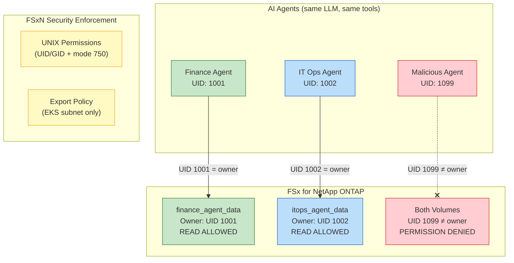
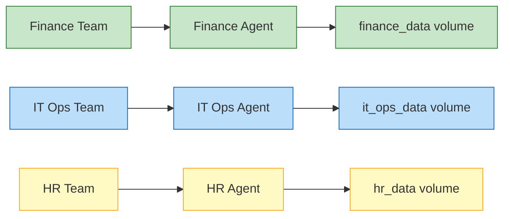
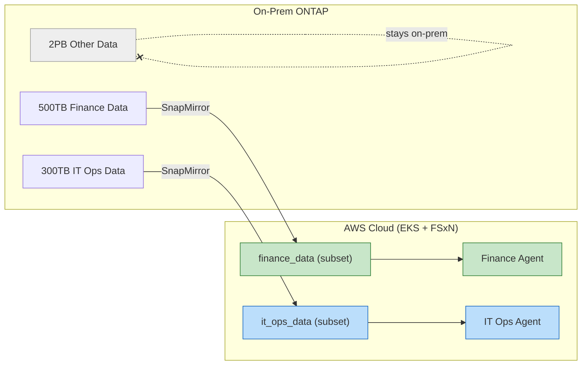
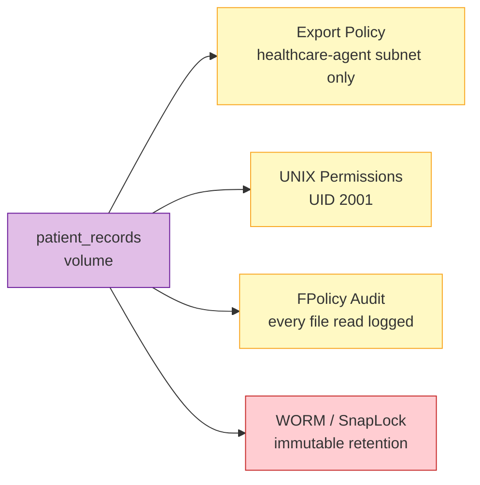

## What You Demonstrated

In this module, you built a real-world scenario where **multiple AI agents** with different roles access a shared storage system — and proved that **FSx for NetApp ONTAP's native security** enforces strict data boundaries regardless of what the AI agent or LLM attempts.

---

## Key Takeaways

### 1. Storage-Level Security is Non-Bypassable by AI Agents

Unlike application-layer controls (API keys, prompt guardrails, output filters), **ONTAP storage security operates below the agent's execution layer**. The agent process literally cannot read bytes it's not authorized to access — no prompt injection, jailbreak, or tool manipulation can override filesystem-level permissions.

### 2. Defense-in-Depth with FSxN Native Features

| Security Layer | FSxN Feature | What It Controls |
|---------------|-------------|-----------------|
| **File Access (Primary)** | UNIX Permissions (UID/GID) | Which process UIDs can read/write files |
| **Network Access** | Export Policies | Which host IPs can NFS-mount a volume |
| **File Access** | UNIX Security Style | Which UIDs/GIDs can read/write files |
| **Data Isolation** | Volumes / Qtrees | Separate filesystem namespaces per domain |
| **Protocol** | Read-Only Mounts | Agents can read but never modify source data |
| **Encryption** | In-transit + at-rest | Data encrypted with ONTAP native encryption |

### 3. Same LLM, Different Access = Safe Multi-Tenancy

All three agents used the **same Mistral-7B LLM endpoint**. The intelligence is shared; the data access is segregated. This pattern enables:
- **Cost efficiency** — One LLM serving multiple teams
- **Governance** — Each team's data stays within its boundary
- **Auditability** — ONTAP audit logs track every file access per UID

---

## Enterprise Architecture Patterns

### Pattern A: Team-Based Agent Segregation (What You Built)

**Use case:** Multiple departments share a Kubernetes cluster and LLM, each with private data.

### Pattern B: On-Prem to Cloud with Agent Access (SnapMirror + Agents)

**Use case:** Replicate only the data subsets each cloud-hosted agent needs. Bulk data stays on-prem.

### Pattern C: Compliance-Driven Isolation (HIPAA / SOX / GDPR)

**Use case:** Regulated industries where AI agent access must be auditable, restricted, and tamper-proof.

---

## FSxN Features That Enable This Pattern

| Feature | Role in Agentic AI |
|---------|-------------------|
| **Export Policies** | Per-volume IP-based access control — agents from wrong subnet can't mount |
| **UNIX Security** | UID/GID permissions — wrong agent process can't read files |
| **Volumes** | Logical data isolation — each domain has its own volume |
| **SnapMirror** | Replicate on-prem data to cloud for agent consumption |
| **FlexClone** | Instantly clone a volume for agent testing without duplicating data |
| **Snapshots** | Point-in-time recovery if an agent's action corrupts data |
| **FPolicy** | Audit logging of all file access (which agent read what, when) |
| **WORM / SnapLock** | Immutable data for compliance — agents can read but never delete |
| **Storage Efficiency** | Dedup + compression reduce storage costs for multi-tenant agent data |
| **Multi-AZ** | High availability — agents never lose access to their data |

---

## Clean Up (Optional)

If you want to remove the resources created in this module:

:::code[]{language=bash showLineNumbers=true showCopyAction=true}
# Delete agent namespaces (this deletes all resources within them)
kubectl delete namespace agent-finance agent-itops agent-malicious

# Delete jobs in default namespace (if any remain)
kubectl delete job populate-finance-data populate-itops-data --ignore-not-found

# Optionally delete the FSxN volumes
# aws fsx delete-volume --volume-id <finance-vol-id> --region $AWS_REGION
# aws fsx delete-volume --volume-id <itops-vol-id> --region $AWS_REGION
:::

---

## What's Next

This module demonstrated AI agent data segregation on a **single FSx for ONTAP file system**. To extend this pattern:

- **Module 7 — Multi-Model Data Segregation with On-Premises to Cloud Replication** — Shows how to replicate data from on-premises to cloud using SnapMirror, then apply the same agent access controls to the replicated volumes
- **FlexClone for Agent Testing** — Clone a production data volume instantly (zero-copy) to create a sandbox for testing new agent tools without risking production data
- **FPolicy Audit Logging** — Enable ONTAP FPolicy to capture every file access event per agent UID, feeding into your SIEM for compliance reporting

:::alert{header="The Core Principle" type="info"}
**AI agents are only as trustworthy as the security boundaries that constrain them.** Application-layer guardrails (prompt engineering, output filtering) can be bypassed. Storage-layer controls (export policies, UNIX permissions, volume isolation) cannot — they are enforced by the ONTAP controller before any data reaches the agent process. FSx for NetApp ONTAP provides enterprise-grade, multi-layered access control that keeps AI agents within their authorized data boundaries.
:::

