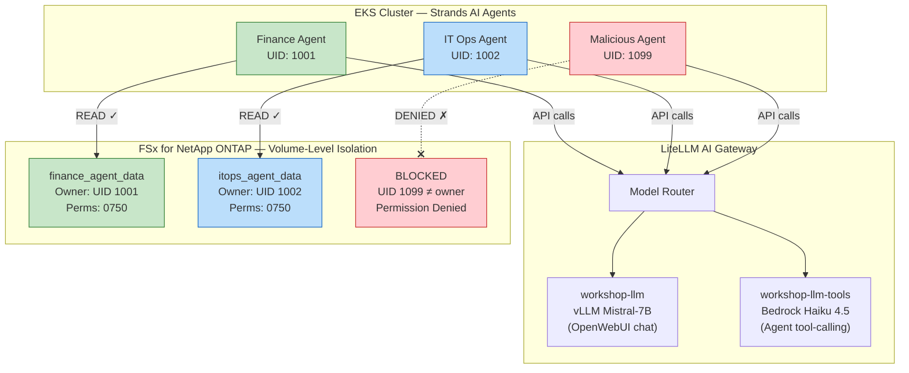

## Module Overview

In enterprise environments, **multiple AI agents** may operate against a shared storage layer — each requiring access to **only its designated data domain**. This module demonstrates how Amazon FSx for NetApp ONTAP's **native security features** (export policies, UNIX permissions, and volume-level isolation) enforce strict data boundaries for AI agents, preventing unauthorized access even when agents share the same cluster and LLM backend.

You will build **three AI agents** using [AWS Strands Agents SDK](https://github.com/strands-agents/sdk-python) (open source), each with a distinct role:

| Agent | Role | Data Access | Outcome |
|-------|------|-------------|---------|
| **Finance Agent** | Financial analyst | `/finance_data` volume only | Answers questions about financial reports |
| **IT Operations Agent** | IT Ops assistant | `/it_ops_data` volume only | Answers questions about runbooks and logs |
| **Malicious Agent** | Simulated attacker | Attempts both volumes | **Blocked** by FSxN native permissions |

:::alert{header="Why This Matters" type="info"}
As organizations deploy autonomous AI agents that can read, analyze, and act on data, **storage-level access control** becomes critical. Unlike application-layer auth that agents could potentially bypass, FSxN enforces permissions at the **storage protocol level** — the agent literally cannot read bytes it's not authorized to access, regardless of what the LLM instructs it to do.
:::

---

## Architecture

**FSxN Security Layers Demonstrated:**

| Layer | Mechanism | What It Blocks |
|-------|-----------|---------------|
| **UNIX Permissions** | UID/GID ownership + file mode (0750) | Wrong UID cannot read files — primary per-agent enforcement |
| **Export Policy** | IP/CIDR-based NFS access rules | Only EKS cluster nodes can mount — network guardrail |
| **Volume Isolation** | Separate ONTAP volumes per domain | Each agent only sees its own PVC mount |

---

::::expand{header="Click here to learn about AWS Strands Agents SDK"}

#### AWS Strands Agents SDK

**Strands Agents** is an open-source Python SDK by AWS for building AI agents with tool-use capabilities. Key features:

- **Model-agnostic** — works with any OpenAI-compatible endpoint (including self-hosted vLLM)
- **Tool-based architecture** — agents have callable tools (Python functions) they can invoke based on user prompts
- **Lightweight** — minimal dependencies, easy to deploy as a container
- **Conversation loop** — agent reasons about the query, selects tools, executes them, and synthesizes a response

In this module, each agent has file-access tools (`list_files`, `read_file`, `search_documents`) that operate against its mounted FSxN volume. The LLM decides which tool to call; the storage layer decides whether the call succeeds.

::::

:::alert{header="Prerequisites" type="info"}
This module assumes you have completed the following modules:
- **Module 1** — Configure storage for model hosting using Amazon FSx for NetApp ONTAP
- **Module 2** — Deploy Generative AI Chat application

You should have:
- A working EKS cluster with Trident CSI driver installed
- The vLLM Mistral-7B inference endpoint running (`vllm-mistral7b-service`)
- The primary FSx for NetApp ONTAP file system available
:::

